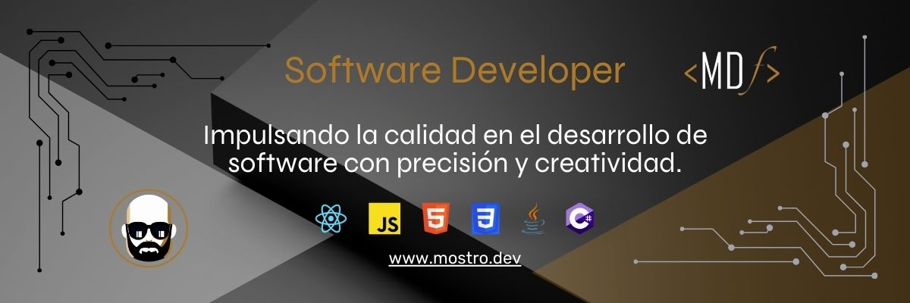

# 👋 ¡Hola! Soy Fabian Velasquez

### 🚀 Acerca de Mí

Soy desarrollador fullstack con un enfoque fuerte en el frontend. Me apasiona explorar nuevas tecnologías y optimizar cada detalle en el desarrollo de interfaces. Mi stack principal incluye React, JavaScript, HTML5, CSS3, Java y C#, herramientas con las que busco crear experiencias de usuario eficientes y modernas. Actualmente, curso estudios en ingeniería de sistemas, complementando mi experiencia en el desarrollo de software y mi habilidad para integrar soluciones robustas que aporten valor tanto a empresas como a usuarios finales.

### 🔧 Tecnologías y Herramientas

- **Lenguajes**: JavaScript, Python, Java, C#
- **Frontend**: React, HTML5, CSS3
- **Backend**: Flask, Python, Java, C#
- **Bases de Datos**: MySQL. PostgrSQL, MicrosoftSQL
- **Otras Herramientas**: VS Code, Git/GitHub, Postman, Azure DevOps

### 🌐 Sitio Web

Visita mi portafolio en [mostro.dev](https://www.mostro.dev) para ver algunos de mis proyectos y conocer más sobre mi trabajo.

### 📫 Conectemos

- [LinkedIn](https://www.linkedin.com/in/fabianvegadev)
- [Correo](fabianvegadev@gmail.com)

---

¡Gracias por visitar mi perfil! Siempre estoy abierto a colaboraciones y nuevos desafíos.
